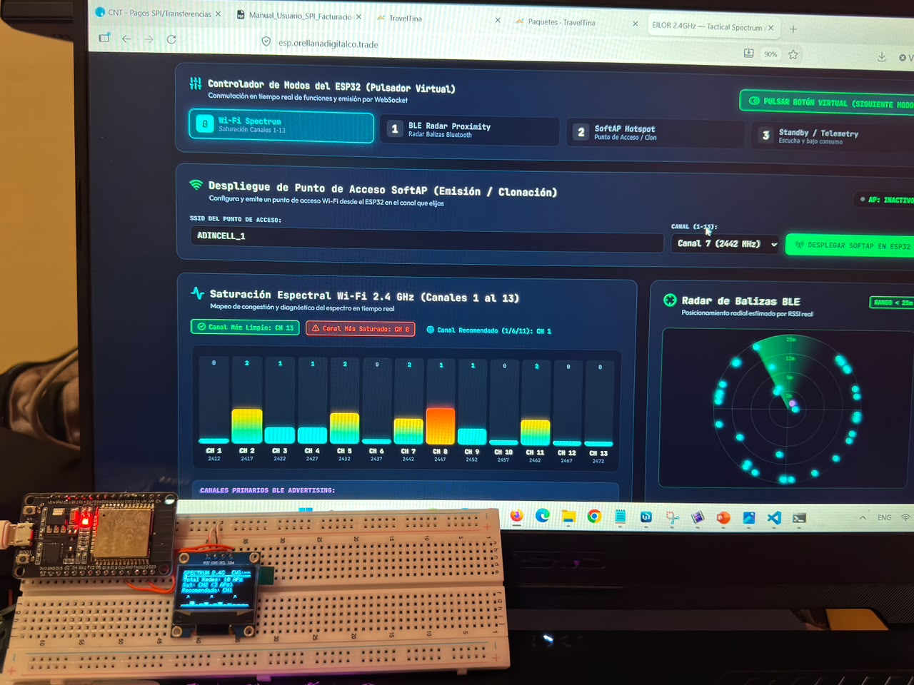
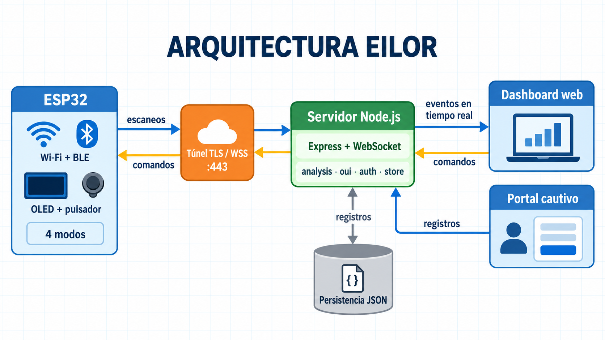
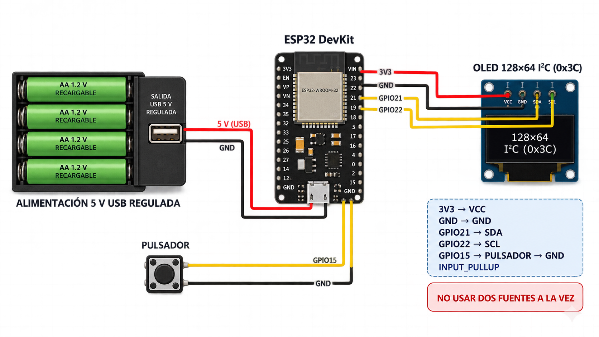
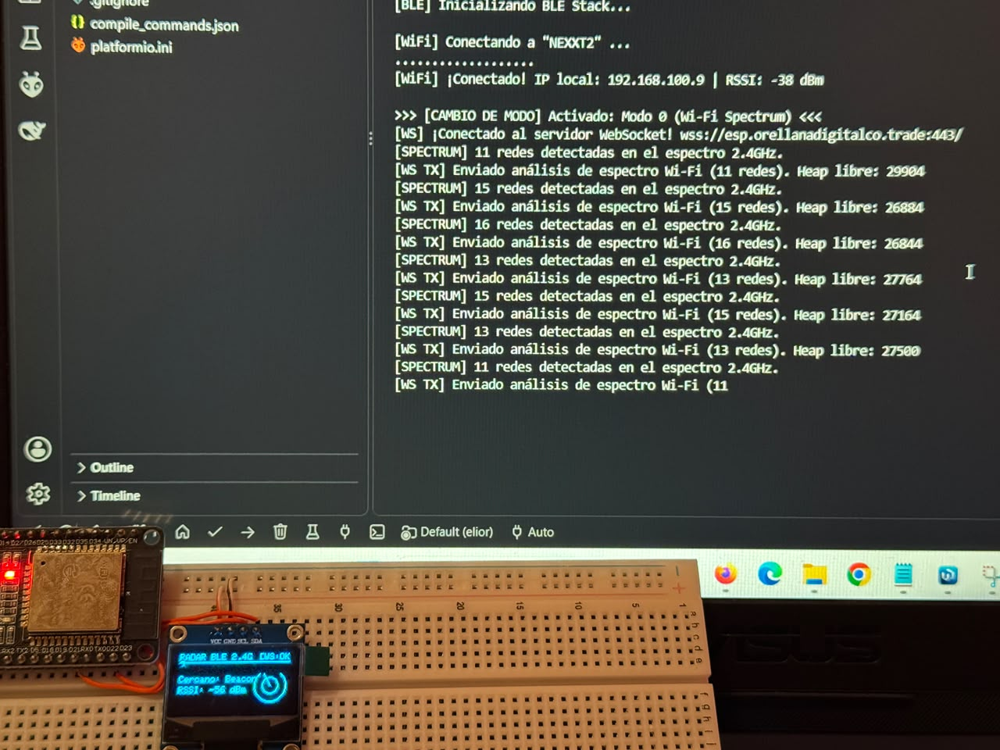
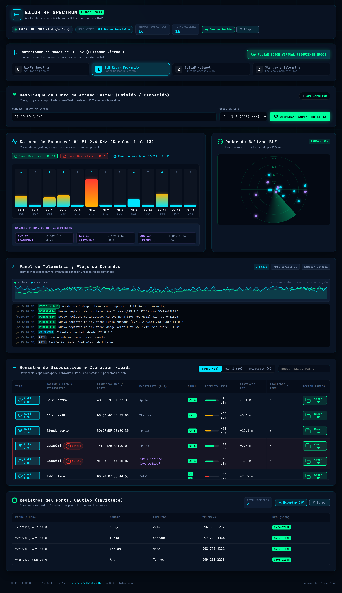
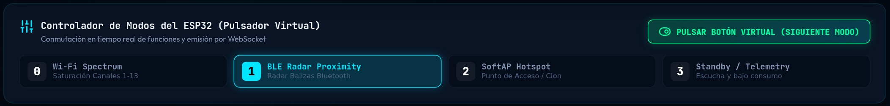
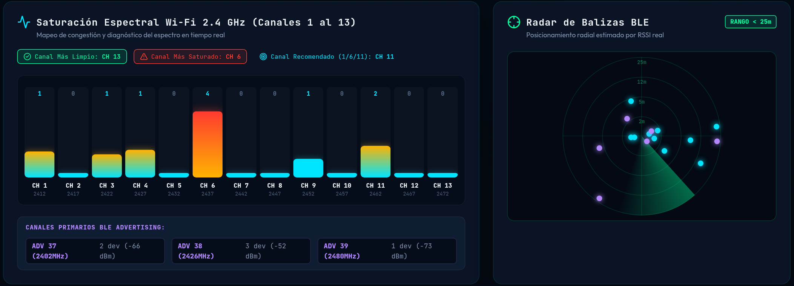
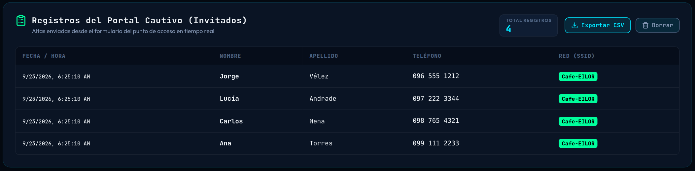
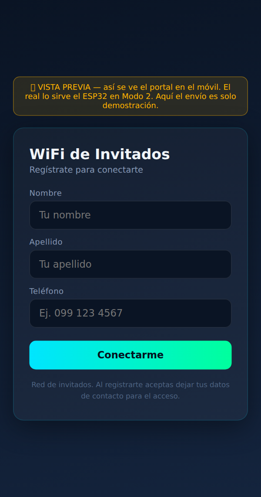

# EILOR

## Suite ESP32 para espectro Wi‑Fi, radar BLE y portal cautivo

<p align="center">
  
</p>

<p align="center">
  
</p>

EILOR es una plataforma educativa de monitoreo del entorno inalámbrico de 2.4 GHz. Integra un ESP32 con pantalla OLED, un servidor Node.js, comunicación WebSocket en tiempo real y un dashboard web para observación, telemetría y control autorizado.

## Enlaces públicos

| Recurso | URL |
|---|---|
| Repositorio del proyecto | [github.com/ptandazoz9827/evil-esp32](https://github.com/ptandazoz9827/evil-esp32) |
| Dashboard desplegado | [esp.orellanadigitalco.trade](https://esp.orellanadigitalco.trade/) |
| Código fuente del servidor | [server.js](https://github.com/ptandazoz9827/evil-esp32/blob/main/server.js) |
| Firmware ESP32 | [firmware/eilor_esp32.ino](https://github.com/ptandazoz9827/evil-esp32/blob/main/firmware/eilor_esp32.ino) |
| Vista previa del portal | [public/portal-preview.html](https://github.com/ptandazoz9827/evil-esp32/blob/main/public/portal-preview.html) |

## Arquitectura

<p align="center">
  
</p>

El ESP32 analiza redes Wi‑Fi y dispositivos BLE, envía telemetría por WebSocket seguro y recibe comandos del dashboard. El servidor Node.js procesa las mediciones, mantiene el estado en memoria, persiste datos locales y entrega la interfaz web. En producción, Cloudflare Tunnel publica el servicio sin exponer puertos entrantes.

## Funcionalidades

- Análisis de espectro Wi‑Fi en la banda de 2.4 GHz.
- Radar de proximidad BLE mediante paquetes de advertising.
- Pantalla OLED SSD1306 para estado, modo, red y telemetría.
- Cuatro modos: espectro Wi‑Fi, radar BLE, SoftAP y standby/telemetría.
- Portal cautivo para una red propia y autorizada.
- Registros de invitados, exportación CSV y cola local ante cortes de enlace.
- Dashboard con WebSocket, autenticación de sesión y control remoto.
- Detección de SSID repetidos y visualización de fabricante/OUI.

## Vista del sistema

<p align="center">
  
  
</p>

## Dashboard

<p align="center">
  
</p>

<p align="center">
  
  
</p>

<p align="center">
  
  
</p>

## Estructura del repositorio

```text
firmware/eilor_esp32.ino   Sketch para ESP32
server.js                   Servidor Express + WebSocket
lib/                        Autenticación, análisis, OUI y persistencia
public/                     Dashboard y vista previa del portal
figuras/                    Diagramas y capturas para la documentación
package.json                Dependencias y comando de inicio
data/                       Estado local (ignorado por Git)
```

El material LaTeX del informe académico se conserva localmente, pero no forma parte de este repositorio. Solo se publican las figuras seleccionadas para documentar el sistema.

## Puesta en marcha del servidor

Requisitos: Node.js 18 o superior.

```bash
npm install
EILOR_PASSWORD="cambia-esta-clave" \\
EILOR_DEVICE_TOKEN="token-del-dispositivo" \\
npm start
```

El dashboard local queda disponible en `http://localhost:3002`. Variables disponibles:

| Variable | Descripción |
|---|---|
| `EILOR_PASSWORD` | Contraseña obligatoria del dashboard. |
| `EILOR_DEVICE_TOKEN` | Token opcional para restringir la ingesta del ESP32. |
| `HOST` | Interfaz de escucha; por defecto `127.0.0.1`. |
| `PORT` | Puerto HTTP/WebSocket; por defecto `3002`. |

## Configuración del ESP32

1. Abra `firmware/eilor_esp32.ino` en Arduino IDE o PlatformIO.
2. Instale `WebSockets` (Markus Sattler), `Adafruit SSD1306`, `Adafruit GFX` y `ezButton`.
3. Configure localmente `WIFI_SSID`, `WIFI_PASS`, `WS_SERVER_HOST` y, si corresponde, `DEVICE_TOKEN`.
4. Seleccione **ESP32 Dev Module**, el puerto correcto y cargue el sketch.

El archivo publicado contiene marcadores de posición; no incluya credenciales reales en commits.

## Modos de operación

| Modo | Función |
|---:|---|
| 0 | Espectro Wi‑Fi: redes, canales y saturación. |
| 1 | Radar BLE: balizas, RSSI y proximidad estimada. |
| 2 | SoftAP y portal cautivo de una red propia autorizada. |
| 3 | Standby y telemetría del dispositivo. |

## Uso responsable

Utilice el escaneo y el portal cautivo únicamente en redes propias o con autorización expresa. No suplante redes de terceros ni recopile datos personales sin aviso, consentimiento y controles de retención adecuados.

## Seguridad antes de desplegar

- Defina siempre `EILOR_PASSWORD` y `EILOR_DEVICE_TOKEN` en producción.
- Mantenga `data/`, `.env` y cualquier archivo de credenciales fuera del repositorio.
- Publique el dashboard detrás de HTTPS/WSS y limite el acceso administrativo.
- Rote las credenciales si se comparten o quedan expuestas.

## Licencia

El repositorio conserva el archivo `LICENSE` original. Revise sus términos antes de redistribuir el proyecto fuera del contexto académico.
